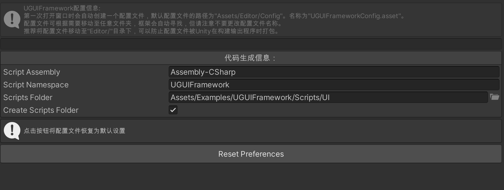
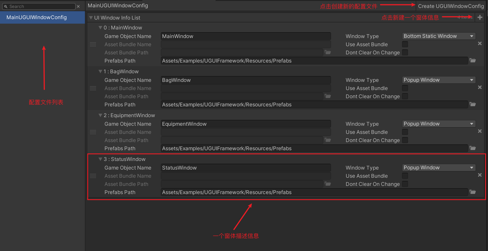

# MFramework

## 一、MVC框架

### 1 .MVC架构

经典MVC模式中，M是指业务模型，V是指用户界面，C则是控制器，使用MVC的目的是将M和V的实现代码分离，从而使同一个程序可以使用不同的表现形式。其中，View的定义比较清晰，就是用户界面。

MVC详解可以参考知乎回答[如何理解MVC](https://wjrsbu.smartapps.cn/zhihu/article?_swebfr=1&id=35680070&isShared=1&hostname=baiduboxapp)，在此便不再过多赘述。下面详解一下本框架的实现思路与使用案例。

###  2.框架实现思路

####  (1). 定义MVC框架管理器——MVCSystem。

该类为静态类，主要存储MVC中的数据并完成事件的转发。

在其中存储三个字典：

1. View名称与BaseView对象字典。
2. Model名称与BaseModel对象字典。
3. 事件名称(EventName)与BaseController类型的Type对象。

并且提供响应的注册与删除方法。同时提供查询View与Model的方法（根据名字和类型查找），方便在Controller中查询到View与Model，并调用相应方法。

最后，在MVCSystem中，最重要的方法是SendEvent方法，该方法接收两个参数(一个参数和一个不定参数列表)——发送事件名字与发送数据。MVCSystem会在Controller与View中查找注册了该事件类，并触发他们中的HandleEvent方法。

在阅读知乎的文章后，我们知道Controller其实是View的一种。就好比在J2EE框架中，JSP作为前端显示页面，其中也可以包含Servlet中的Java代码，而Servlet就是JSP的一种只用来处理逻辑的形式。所以在View层中我们也可以让其直接接收事件并相应，无需经过Controller转发（因为View本身也是一种Controller），从而减少Controller数量。

####  (2). 定义View层基类——BaseView。

该类为抽象类，并且继承自MonoBehaviour，是游戏展示给玩家的元素的控制类（UI元素以及非UI元素）。

1. 在其中存储一个列表(_attationEvents)，用来保存View响应事件的事件名称(EventName)。

2. 提供一个抽象属性Name，用作View的唯一标识。

3. 提供注册响应事件虚方法(RegisterAttationEvents)，子类通过重写该方法注册具体的响应事件。(由于存储响应事件的列表是私有的，子类无法直接访问，可以通过父类提供的RegisterAttationEvent方法添加)

4. 提供响应事件的抽象方法(HandleEvent)，方法第一个参数为事件名称(EventName)，可以通过它来判断当前响应的是什么事件。

5. 提供获得模型的方法。

6. 提供发送事件方法(调用MVCSystem中的发送事件的方法，尽量隐藏MVCSystem，避免外界调用)。

#### (3). 定义Model层基类——BaseModel。

该类为抽象类，主要用存储数据并处理数据逻辑。

1. 提供一个抽象属性Name，用作View的唯一标识。
2. 提供发送事件方法(调用MVCSystem中的发送事件的方法，尽量隐藏MVCSystem，避免外界调用)。

 #### (4). 定义Controller层基类——BaseController。

该类为抽象类，主要用来响应并处理请求。

1. 提供注册、查询、删除Model和View的方法(调用MVCSystem中的对应的方法，尽量隐藏MVCSystem，避免外界调用)。
2. 提供抽象方法(Execute)，用以响应并处理请求。(由于事件名称(EventName)与Controller是一一对应，所以参数中不包含事件名称)。

### 3.案例

- 利用该框架复刻了经典游戏[《俄罗斯方块》](https://github.com/PositiveMumu/Tetris)。可以通过该案例来具体学习本框架在项目中的具体应用。

## 二、资源池（ResourcePool)

### 1. 简单资源池——V1.0.0版本

### (1). 介绍

简单资源池保存所有被生成的实例。当项目中需求的某种资源数量大于资源池中的数量时，资源池会实例化新的对象并持有它的引用。资源池中每个子对象池引用的数量没有上限。提供强制回收所有资源的方法。

框架中包含有：

- IResuable接口，继承该接口需要实现`Spawn`和`Unspawn`方法，两个方法分别在从资源池中获得和回收资源时调用，主要实现初始化对象和清除脏数据。
- ResuableObject抽象类，实现IResuable接口的抽象类（仅仅包含接口中的两个方法）。
- SubObjectPool类，子对象池类，保存具体的一类资源。
- ObjectPool单例类，管理资源的创建、分配、回收和销毁。

### (2). 使用方法

1. 资源池管理的所有资源都要被制作成prefab。
2. 将ObjectPool组建添加至场景的物体中，并对ResourceDir赋值，该路径地址为资源池管理资源在Resources目录下的地址（框架通过Resources.Load加载资源）。
3. 在需要获得对象的地方使用`ObjectPool.Spawn(string prefabName)`方法获得预制体对象，函数返回值类型为`GameObject`。
4. 在需要回收对象的地方使用`ObjectPool.Unspawn(GameObject prefab)`方法回收预制体对象。

### (3). 补充说明

如果预制体并没有存放在Resources目录下的相同文件夹中，那么ResourceDir需要赋值为公共文件夹部分。在获取对象时要加入差异文件夹前缀。

例如：GoldEffect预制体被放置在Resources/Prefabs/Effect文件夹下，GoldElement预制体被放置在Resources/Prefabs/Element文件夹下。

则ResourceDir需要赋值`Resources/Prefabs`。在使用`ObjectPool.Spawn`方法时传递的参数为`Effect/GoldEffect`或者`Element/GoldElement`。

如果GoldEffect预制体和GoldElement预制体被放置在Resources/Prefabs文件夹下。

则ResourceDir需要赋值`Resources/Prefabs`。在使用`ObjectPool.Spawn`方法时传递的参数为`GoldEffect`或者`GoldElement`即可。

## 三、UGUI框架（UGUIFramework）

### 1. 介绍

UGUI框架是一个管理UI界面逻辑关系的框架，控制UI窗口的创建、打开、隐藏、关闭并销毁等流程。

关于框架自动创建的UI窗口管理脚本主要有三个：

1. Window：负责处理界面数据逻辑。
2. Window.Designer：负责处理界面显示逻辑。
3. WindowData：负责处理界面数据（可以不用，直接在Window中进行处理）。

在Window.Designer中重写了UGUIWindowBase的生命周期函数：

1. OpenWindow()：在第一次打开窗体时调用。
2. ShowWindow()：在显示界面时调用。
3. HideWindow()：在隐藏界面时调用。
4. CloseWindow()：在关闭并销毁界面时调用。

### 2. 使用方式

1. 制作UI窗口，尽量按界面划分。例如登录窗口、注册窗口、主窗口、背包窗口，任务窗口等。
2. 将制作好的UI界面保存为Prefab，放置在Resources目录下（目前只支持Resources加载，AssetBundle方式将在后续版本中支持）。
3. 点击Tools/UGUIFramework/Preference按钮，打开UGUI框架配置窗口，进行配置。
	
   
   - Script Assembly：UI脚本程序集，默认为Unity默认程序集，如果读者自定义了程序集，请填入自定义程序集名称。
   - Script Namespace：UI脚本命名空间，默认为UGUIFramework，读者可根据需要自行修改。
   - Scripts Folder：UI脚本保存路径，拖动文件夹可自动赋值。
   - Create Scripts Folder：选中时将在UI脚本保存路径中创建一个与挂载UI脚本的预制体名称相同的文件夹来存放脚本。
4. 在Assets窗口中右键UI窗口预制体，选择Create UGUIWindowCode。自动生成UI窗口预制体控制脚本。
5. 点击Tools/UGUIFramework/按钮，打开UGUI框架配置窗口，进行配置。
	
	- GameObjectName：挂载UI控制脚本的窗口预制体名称（通常情况下预制体名称与脚本名称相同）。
	- WindowType：窗体类型
	  - BottomStaticWindow：底部静态窗口，永远处在最低层的窗体，适合放置主界面（负责显示其他界面）。
	  - PopupWindow：弹出窗口，处在中间层，可随意调整层级的窗体，适合放置任务界面、背包界面等频繁打开关闭的界面。
	  - TopStaticWindow：顶部静态窗口，永远处在最顶端的窗体，适合放置提示界面等要显示在最前面的界面。
	- UseAssetBundel：使用AssetBundle加载资源（暂不支持）。
	- AssetBundleName：存在UI界面预制体的AssetBundle包的名称（暂不支持）。
	- AssetBundlePath：存在UI界面预制体的AssetBundle包的名称（暂不支持）。
	- DontClearOnChange：在切换配置文件时不销毁被标记的窗口。
	- PrefabsPath：预制体存放路径（Resources目录下），拖拽文件夹自动赋值。
6. 在UI控制脚本中添加逻辑。
7. 在游戏初始化时调用`UGUIWindowManager.Instance.InitUGUIFramework(配置文件);`初始化。

### 3. API介绍

关于窗口管理脚本的生命周期在第1节中有简单介绍，读者只需在对应的重写函数中添加自己的操作即可。

UGUIWindowManager类是框架的核心管理类，作为一个单例类，读者可通过UGUIWindowManager.Instance来访问具体方法。

下面介绍UGUIWindowManager的主要API：

1. InitUGUIFramework方法：初始化框架，参数为配置文件。
2. OpenWindow方法：打开一个窗口。
3. HideWindow方法：隐藏一个窗口。
4. CloseWindow方法：关闭并销毁一个窗口。
5. HideAllWindow方法：隐藏所有或一类窗口。
6. CloseAllWindow方法：关闭并销毁所有或一类窗口。

UGUIWindowManager中的Stack成员可用于实现栈模式管理窗口，读者可通过UGUIWindowManager.Instance.Stack来访问具体方法。

针对于栈模式（详见第4节）的API如下：

1. PushWindow方法：入栈并显示一个窗体。
2. PopAllWindow方法：关闭栈中所有的窗体。

关闭单个窗口的方法被封装在窗口管理脚本中，在窗口的退出按钮点击事件中调用“BackWindow”方法就可以关闭窗口。

具体API支持的参数及参数的含义可以观看代码注释或在调用时阅读IDE给出的方法提示，在这里就不过多赘述。

### 4. 窗口管理模式介绍

#### 普通模式

利用第3节中介绍的API管理的窗体，本质上没有任何关联，关闭一个窗口并不会影响其他窗口。

#### 栈模式

栈模式中显示窗口会被不断的压入栈中，如果关闭的不是栈顶的窗口，那么在要关闭的窗口之后打开的所有窗口也会被一同关闭。

例如打开顺序：A-B-C。如果此时关闭B窗口，那么B窗口与C窗口会被一同关闭。

##### 栈模式使用举例：

1. 初始化UGUI框架
2. 调用PushWindow<MainWindow>()方法打开了主界面。
3. 在MainWindow脚本中添加OnCloseButtonDown方法，并为MainWindow预制体中的返回按钮绑定该点击事件。
4. 在OnCloseButtonDown方法中调用BackWindow方法。这个方法在UGUIWindowBase中被定义。

上述操作完成后，当我们运行程序变回打开MainWindow，点击MainWindow中的关闭按钮，MainWindow会被关闭。

### 5. 建议与提醒

#### 配置文件

框架支持多配置文件模式，例如可以每个场景（Scene）一个配置文件，用来配置当前场景的UI窗口信息。当切换界面时重新调用框架初始化方法传入新场景的配置文件即可。

在上述的模式中，如果存在一些需要跨场景显示的窗口，那么可以将窗口的DontClearOnChange属性设置为true。这样在切换配置文件时该窗口信息也不会被销毁。

当然最简单的方法就是只利用一个配置文件来存储所有窗口信息，不过当窗口过多时配置文件可能相对较大，并在占用的内存也会增加。

#### 管理模式的交叉使用

普通模式与栈模式可交叉使用，但是注意二者并不互通，即利用栈模式的PushWindow方法打开的界面无法利用普通模式的HideWindow方法关闭。读者需要自行控制两种模式的协同。

#### UI窗口排序

当点击某个窗口时，该窗口会被移动到窗口所处层级的最前面，不会被该层级的其他窗口遮挡并且遮挡该层级的其他窗口。但当点击UI窗口中的按钮（或者其他可以拦截点击事件的组件）时这个操作不会被触发。在编写UI窗口中的按钮（或者其他可以拦截点击事件的组件）绑定的点击（或其他）事件时，建议在方法的最开始手动调用SetWindowAsFocusWindow方法（被定义在UGUIWindowBase中）。该方法可以让当前点击按钮的窗口移动到窗口所处层级的最前面，不会被其他窗口遮挡。

